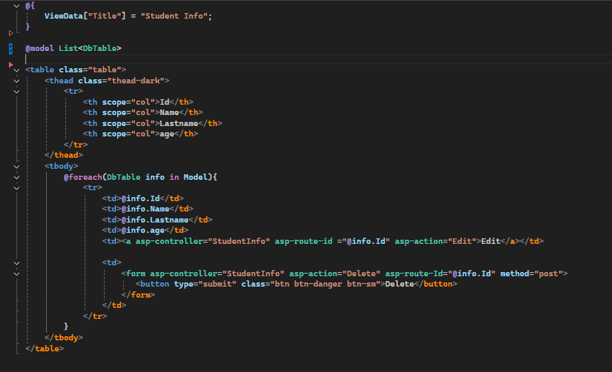
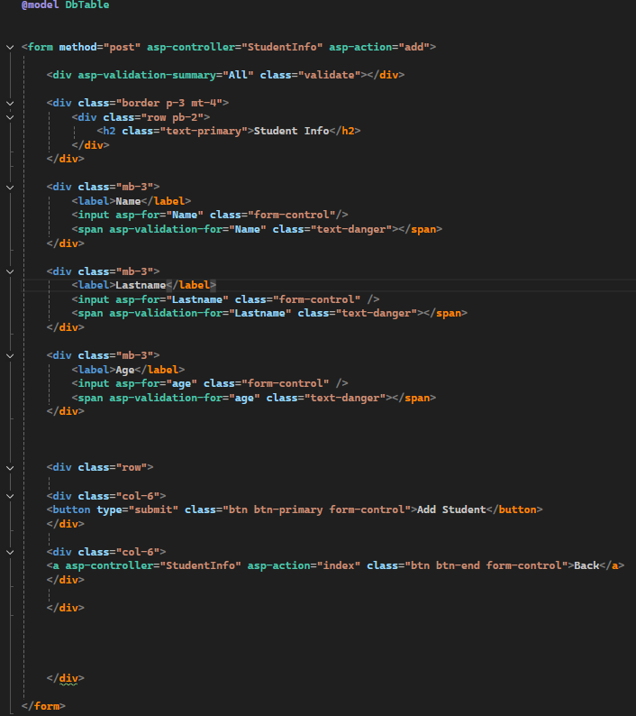
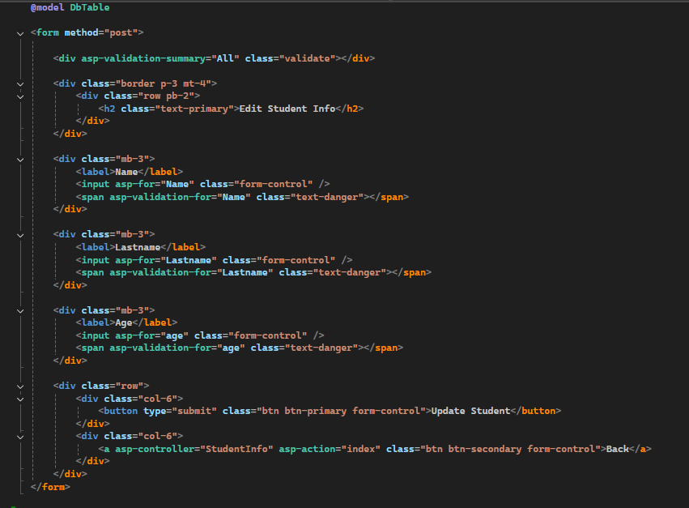
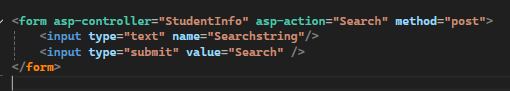

# Multipage-CRUD
A step-by-step guide to building Create, Read, Update, and Delete (CRUD) functions using separate pages — one view for the table, one for editing, and one for adding new data
 
<br>
<br> 
    
   
### 1. Create Model

```csharp
using System.ComponentModel;
using System.ComponentModel.DataAnnotations;
using System.Diagnostics.CodeAnalysis;
using System.Runtime.InteropServices;

namespace Asp.NetCore_MVC_Practice.Models
{
    public class DbTable
    {
        [Key]
        public int Id { get; set; }

        [Required]

        [MaxLength(20, ErrorMessage = "Name must be 20 characters only")]
        [DisplayName("Name")]
        public string? Name { get; set; } 


        [MaxLength(20,ErrorMessage = "Lastname must be 20 characters only")]
        [DisplayName("Lastname")]
        public string? Lastname { get; set; }


        [Range(1,100,ErrorMessage = "To old must be not required")]
        [DisplayName("Age")]
        public int? age { get; set; }

       
    }
}


```


<br>


### 2. Create  VIEW FOR TABLE,    VIEW FOR EDIT,    VIEW FOR Add Data

1. View for table 



<br>

2. View for  Add data




3. View for Edit




<br>
<br>


4. If you want to add a search feature, here are some options you can try.
   
Place this code above the table section to ensure it works properly.

   


<br>
<br>
<br>


# After creating the views, the next step is to create the controller that will handle their logic.

<br>

1. Controller logic for Table View

```csharp

        //display data from table in html
        public IActionResult Index()
        {
            List<Models.DbTable> studentInfoList = _db.StudentInfo.ToList();
            return View(studentInfoList);
        }
```


<br>


2. Controller logic for Input or Add data

```csharp


        //add record to the database
        [HttpPost]
        public IActionResult add(Models.DbTable obj)
        {
            _db.StudentInfo.Add(obj);
            _db.SaveChanges();
            return RedirectToAction("index");
        }
       
```


<br>


3. Controller logic for Edit

```csharp


      
        //Retrieve the ID from the route so you can load the correct data into the edit form.
        public IActionResult Edit(int id)
        {
            var GetEdit = _db.StudentInfo.Find(id);
            return View(GetEdit);
        }


        //Update the record in the database.
        [HttpPost]
        public IActionResult Edit(Models.DbTable studentData)
        {

            var edit = _db.StudentInfo.Find(studentData.Id);


            if (edit != null)
            {
                edit.Name = studentData.Name;
                edit.Lastname = studentData.Lastname;
                edit.age = studentData.age;

                _db.SaveChanges();
            }
            return RedirectToAction("index");
        }

       
```


<br>


4. Controller for Delete data

  ```csharp

     [HttpPost]
     public IActionResult Delete(int id)
     {
         var record =  _db.StudentInfo.Find(id);
         if(record == null)
         {
             return NotFound();
         }
         _db.StudentInfo.Remove(record);
         _db.SaveChanges();

         return RedirectToAction("index");
     }

       
```

<br>

5. Controller for Search Data

  ```csharp

    
        [HttpPost]
        public async Task<IActionResult> Search(string Searchstring)
        {
            if (_db.StudentInfo == null)
            {
                return Problem("");
            }
            var names = from m in _db.StudentInfo select m;

            if (!String.IsNullOrEmpty(Searchstring))
            {
                names = names.Where(s => s.Name!.ToUpper().Contains(Searchstring.ToUpper()));
            }

            return View("index",await names.ToListAsync());

        }

       
``` 


